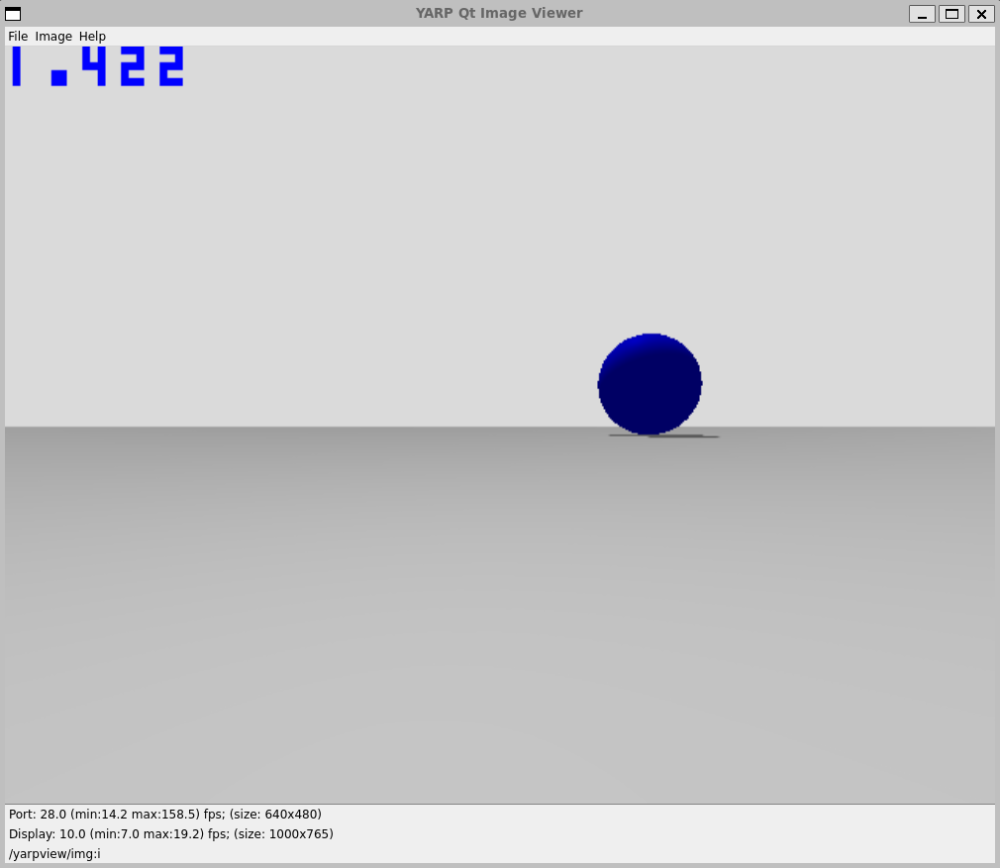

# Run Camera Plugin in Gazebo Garden

## Run model in Gazebo Garden with YARP integration

- 1st terminal:
  ~~~
  yarp server
  ~~~
- 2nd terminal:
  ~~~
  cd tutorial/camera/model_horizontal_flip
  gz sim model.sdf
  ~~~
- 3rd terminal:
  ~~~
  yarpview
  ~~~
- 4th terminal:
  ~~~
  yarp connect /camera /yarpview/img:i
  ~~~

Finally start the simulation in Gazebo.
- yarpview window
  
- Gazebo simulation
  

If you are using Linux on WSLg and you have the following error
~~~
OGRE EXCEPTION(9:UnimplementedException):  in GL3PlusTextureGpu::copyTo at ./RenderSystems/GL3Plus/src/OgreGL3PlusTextureGpu.cpp (line 685)
~~~
try forcing software rendering:
~~~
export LIBGL_ALWAYS_SOFTWARE=1
~~~

