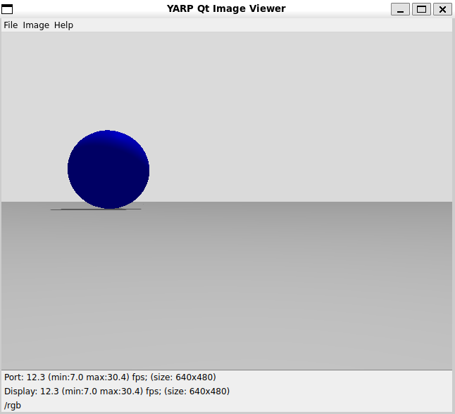
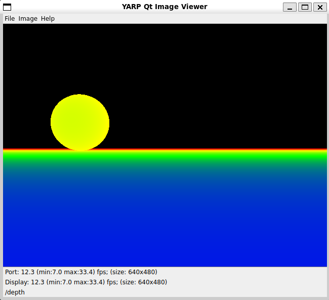
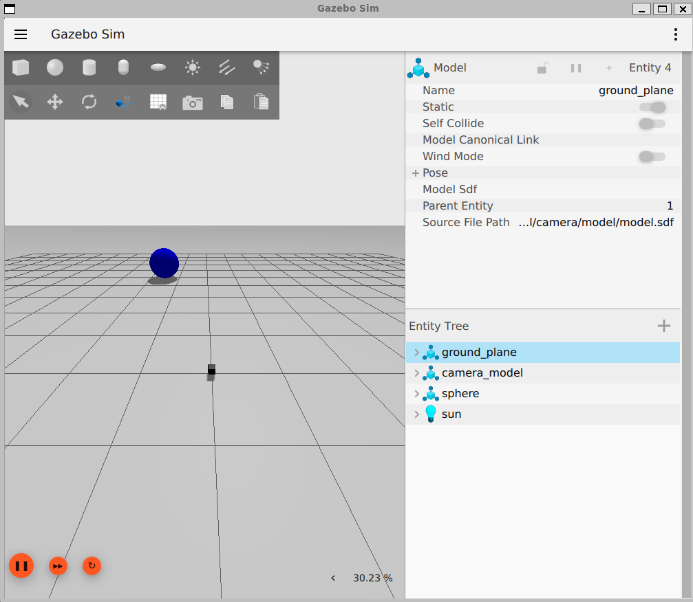

# Run Camera Plugin in Gazebo

## Run model in Gazebo with YARP integration

- 1st terminal:
  ~~~
  yarp server
  ~~~
- 2nd terminal:
  - Update the `GZ_SIM_RESOURCE_PATH` environment variable to point to the `tutorial` folder:

    ~~~
    export GZ_SIM_RESOURCE_PATH = $GZ_SIM_RESOURCE_PATH:<path-to-tutorial-folder>
    ~~~

  - Then, launch Gazebo:

    ~~~
    cd <path-to-tutorial-folder>/depthcamera/model
    gz sim model.sdf
    ~~~

- 3rd terminal:
  ~~~
  yarpview --name /rgb & yarpview --name /depth
  ~~~
- 4th terminal:
  ~~~
  yarp connect /depthcamera/rgbImage:o /rgb fast_tcp
  yarp connect /depthcamera/depthImage:o /depth fast_tcp+recv.portmonitor+type.dll+file.depthimage_to_rgb
  ~~~

Finally start the simulation in Gazebo.
- yarpview rgb window
  
- yarpview depth window
  
- Gazebo simulation
  
