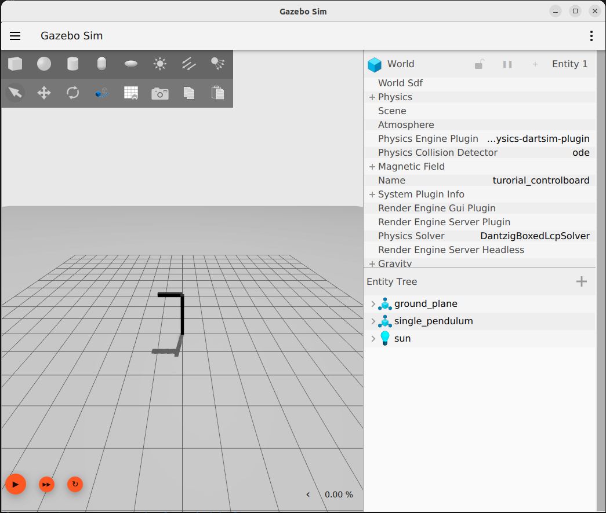
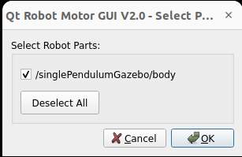

# Run single pendulum tutorial in Gazebo Garden

## Run model in Gazebo Garden with YARP integration

- 1st terminal:

  ~~~bash
  yarp server
  ~~~

- 2nd terminal:

  ~~~bash
  cd tutorial/single_pendulum
  gz sim model.sdf
  ~~~

  The Gazebo GUI will open and the single pendulum should be already spawned in the scene.

  

- 3rd terminal:

  ~~~bash
    cd tutorial/single_pendulum
    yarpmotorgui
  ~~~

  The [yarpmotorgui](https://www.yarp.it/latest/group__yarpmotorgui.html) interface will open and it should automatically prompt you to select the `/singlePendulumGazebo/body` part.
  
  Click Ok.

  

Finally start the simulation in Gazebo (click on the Play button on the bottom left). The pendulum will start to swing freely since the default control mode is **Idle**.

Click on Idle and select **Torque**. A slider will appear on which it is possible to manually set the reference torque [Nm].

